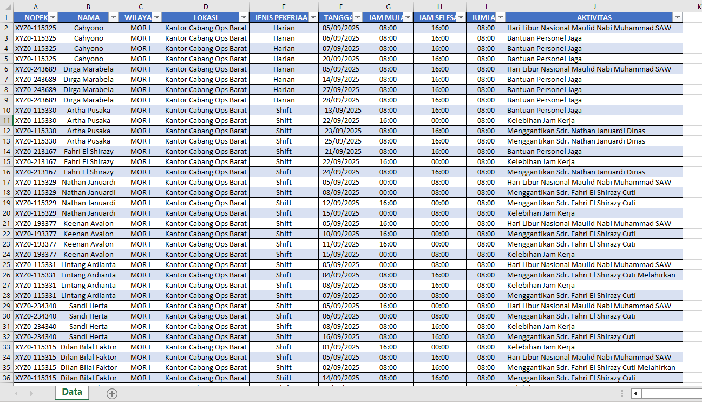
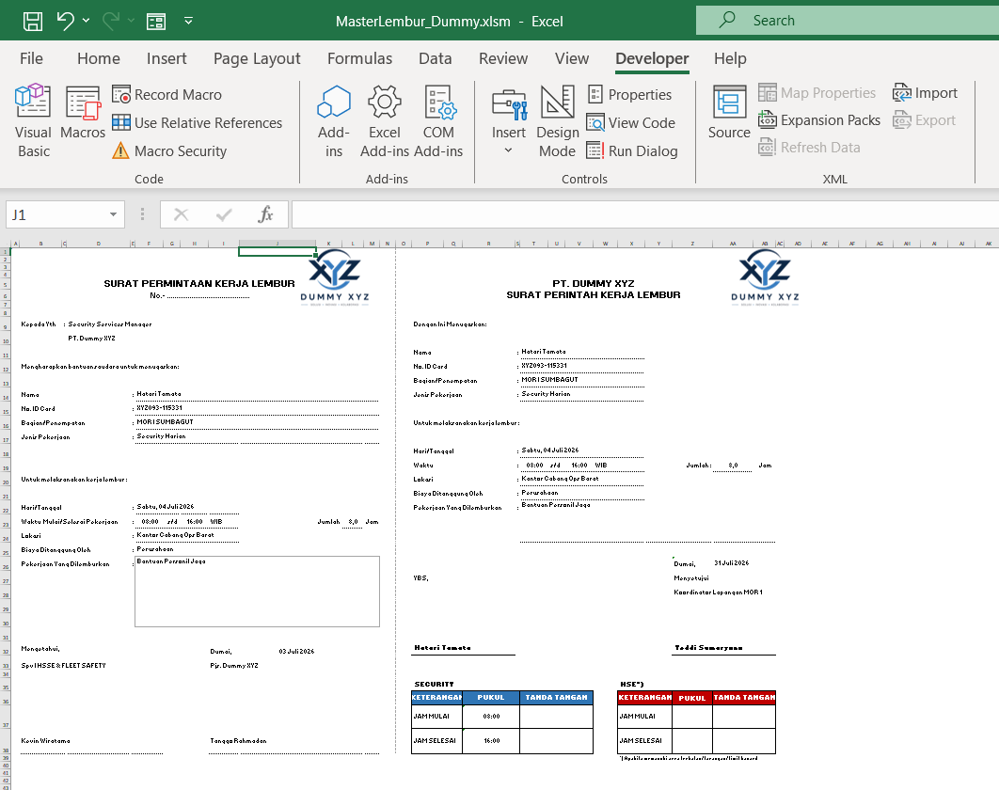
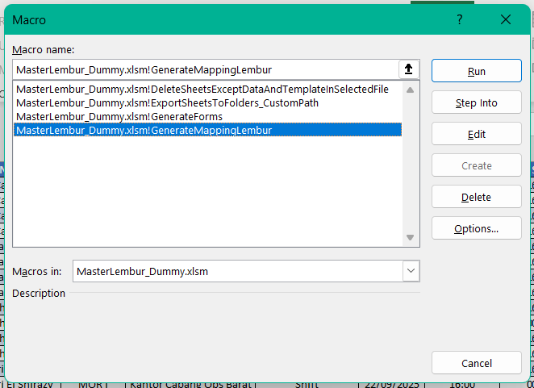
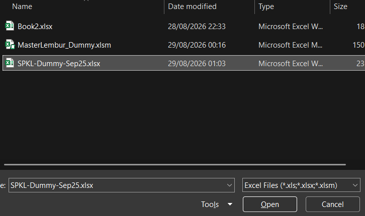
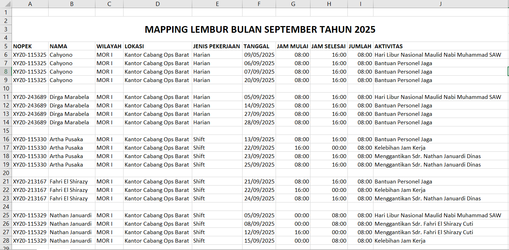
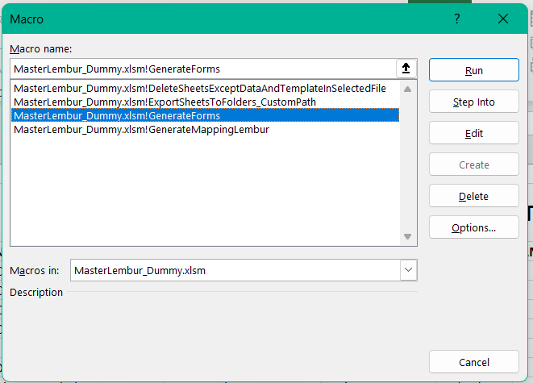
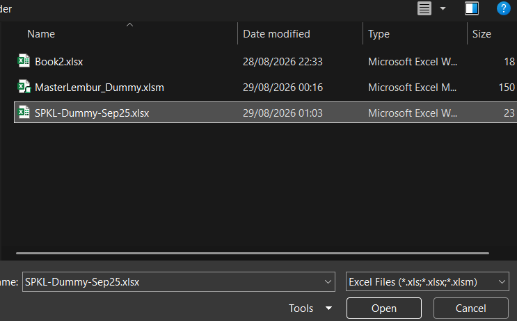
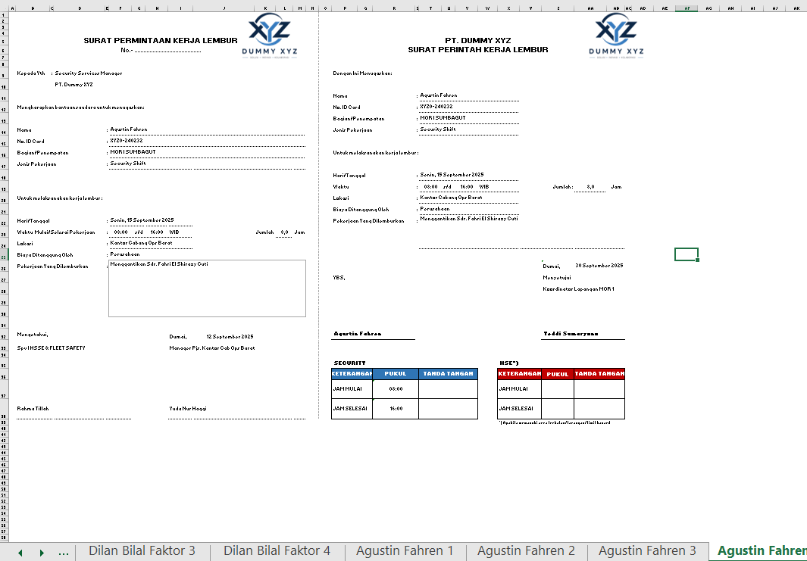

# 📋 Automatisasi Mapping Lembur & Form SPKL (Excel VBA Macro)

Project ini dibuat untuk mengotomatisasi proses **rekap data lembur karyawan** dan **pembuatan Form SPKL (Surat Permintaan/Perintah Kerja Lembur)** yang sebelumnya dikerjakan secara manual. Dengan bantuan Macro & VBA di Excel, proses yang tadinya memakan waktu lama bisa selesai hanya dengan beberapa klik.

Project ini saya buat sebagai bagian dari portofolio saya untuk melamar posisi **Administrasi / Document Control**.

---

## ✨ Fitur Utama

| Fitur | Keterangan |
|---|---|
| 🗂️ **Generate Mapping Lembur** | Merekap seluruh data lembur karyawan dari sheet "Data" menjadi satu tabel mapping bulanan yang rapi dan siap dilaporkan. |
| 📝 **Generate Form SPKL Otomatis** | Membuat Form SPKL (Surat Permintaan Kerja Lembur & Surat Perintah Kerja Lembur) secara otomatis untuk setiap transaksi lembur, sesuai data yang diinput — tanpa copy-paste manual satu per satu. |
| 🧹 **Reset Sheet Hasil** *(`DeleteSheetsExceptDataAndTemplateInSelectedFile`)* | Membersihkan sheet hasil generate sebelumnya, sehingga file kembali ke kondisi awal (hanya sheet Data & Template) sebelum proses generate ulang. |
| 📤 **Export Otomatis ke Folder** *(`ExportSheetsToFolders_CustomPath`)* | Mengekspor setiap sheet hasil (misalnya per Form SPKL) ke folder tujuan secara otomatis. |

---

## 🗃️ Struktur File

```
📦 Automatisasi-Lembur-VBA
 ┣ 📄 MasterLembur_Dummy.xlsm     → File utama berisi macro/VBA
 ┣ 📄 SPKL-Dummy-Sep25.xlsx       → Contoh file data input (sheet "Data")
 ┗ 📁 screenshots                 → Dokumentasi gambar langkah-langkah
```

> ⚠️ File yang digunakan pada dokumentasi ini adalah **data dummy/contoh**, dibuat khusus untuk keperluan demo dan portofolio.

---

## 📑 Format Data (Sheet "Data")

Sebelum menjalankan macro, siapkan data lembur pada Excel dengan urutan kolom berikut:

| NOPEK | NAMA | WILAYAH | LOKASI | JENIS PEKERJAAN | TANGGAL | JAM MULAI | JAM SELESAI | JUMLAH | AKTIVITAS |
|---|---|---|---|---|---|---|---|---|---|

Pastikan nama sheet data adalah **`Data`**, karena macro membaca data berdasarkan nama sheet tersebut.

---

## 🚀 Cara Menggunakan

### 1️⃣ Siapkan Data Lembur
Input data lembur ke dalam tabel, lalu **rename Worksheet menjadi `Data`**. Pastikan urutan kolom sesuai format di atas. Simpan file, misalnya dengan nama `SPKL-Dummy-Sep25.xlsx`.



### 2️⃣ Buka File Macro
Buka file **`MasterLembur_Dummy.xlsm`** — file ini berisi seluruh macro yang dibutuhkan. Pastikan **Macro/Content** sudah di-*enable* saat membuka file.



### 3️⃣ Generate Mapping Lembur
Pada file data (`SPKL-Dummy-Sep25.xlsx`), buka menu Macro (`Alt + F8`), pilih macro **`GenerateMappingLembur`**, pastikan **Macros in** mengarah ke file `MasterLembur_Dummy.xlsm`, lalu klik **Run**.



Pilih file data yang ingin diproses menjadi Mapping Lembur.



Sistem akan otomatis menghasilkan rekap **Mapping Lembur** bulanan, lengkap dan rapi per karyawan.



### 4️⃣ Generate Form SPKL Otomatis
Buka menu Macro, pilih **`GenerateForms`**, lalu klik **Run**.



Pilih file data yang akan dibuatkan Form SPKL-nya.



Macro akan otomatis membuat **Form SPKL** (satu sheet per transaksi lembur) sesuai data yang sudah diinput — lengkap dengan nama, jadwal, dan jam kerja setiap karyawan.



---

## 💡 Manfaat Automasi Ini

- ⏱️ Mempercepat proses rekap lembur yang biasanya dikerjakan manual satu per satu
- ✅ Mengurangi human error saat memindahkan data ke Form SPKL
- 📁 Data dan hasil form tersimpan rapi dan konsisten
- 🔁 Proses bisa diulang untuk periode/bulan berikutnya hanya dengan mengganti data input

---

## 🛠️ Teknologi yang Digunakan
- Microsoft Excel (Macro-Enabled Workbook / `.xlsm`)
- VBA (Visual Basic for Applications)

---

## 👤 Tentang Project Ini
Project ini dibuat sebagai bagian dari portofolio pribadi untuk menunjukkan kemampuan dalam **automasi dokumen administrasi menggunakan Excel VBA**, relevan untuk posisi **Administrasi, Document Control, maupun HR/Admin Support**.

Jika ada pertanyaan atau ingin berdiskusi lebih lanjut mengenai project ini, silakan hubungi saya melalui profil GitHub.
